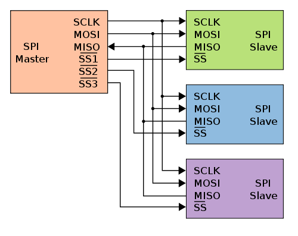
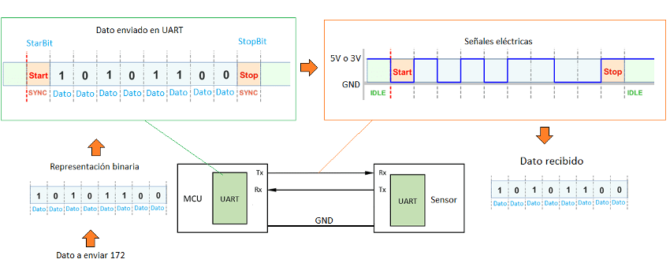

# Protocolos de Comunicación Serie

??? note "Recursos usados"

    - Este video explica maravillosamente lo que aquí se expone
        <iframe
            width="560"
            height="315"
            src="https://www.youtube.com/embed/G7aQB6x0LHc"
            title="YouTube video player"
            frameborder="0"
            allow="accelerometer; autoplay; clipboard-write; encrypted-media; gyroscope; picture-in-picture"
            allowfullscreen
        ></iframe>
    - [En esta página](https://www.drouiz.com/blog/2018/06/25/uart-vs-spi-vs-i2c-diferencias-entre-protocolos/) hay una tabla maravillosa
    - [En esta página](https://solectroshop.com/es/blog/diferencias-de-los-protocolos-de-comunicacion-uart-vs-i2c-vs-spi-n107) explican los protocolos en profundidad.
    - Luis Llamas es una fuente de conocimiento enorme para cualquier maker
        - [Arduino Puerto Serie](https://www.luisllamas.es/arduino-puerto-serie/)
        - [Arduino SPI](https://www.luisllamas.es/arduino-spi/)
        - [Arduino I2C](https://www.luisllamas.es/arduino-i2c/)
    - Distancias del cable para Serial
        - [RS232](https://www.lammertbies.nl/comm/info/rs-232-specs)
        - [Velocidad distancia](https://forum.huawei.com/enterprise/es/velocidad-de-transimisi%C3%B3n-serial-generalmente-a-9600-y-no-115200-%C2%BFpor-qu%C3%A9/thread/506863-100251)

|     | UART | SPI | I2C |
| :-: |:---- | :-- | :-- |
| Nombre | Universal Asynchronous Receiver/Transmitter | Serial Peripheral Interface | Inter-Integrated Circuit |
| Diagrama |  | |  |
| Pines | - TX: Transmisión de datos. - RX: Recepción de datos. | - SCLK: Reloj Serial - MOSI: Salida de maestro, entrada de esclavo. - MISO: Entrada del maestro y salida del esclavo. - SS: Selector de esclavo. | - SDA: Datos - SCL: Reloj Serial |
| Sincronía | Asincrona | Sincrona | Sincrona |
| Tranmisión | Simplex / Duplex | Duplex | Half-duplex |
| Topología | Uno-a-Uno | Bus | Bus |
| Numero de Masters | No hay | Uno | Varios |
| Velocidad máxima | 230Kbbs ~ 460kbb | 10Mbbs ~ 20Mbbs | Hasta 3.4Mbbs Algunas variantes hasta 1Mbbs |
| Distancia | Menos de 15 metros | Comunicaciones dentro de la PCB | Comunicaciones dentro de la PCB |
| Complejidad HW | Poco | Media | Bastante (según los maestros) |
| Direccionamiento SW | No | Señal SS (SS1, SS2…) para seleccionar que dispositivo, cuantos más dispositivos más salidas SS necesitamos. | Todos los maestros pueden comunicarse con todos los esclavos, podemos colocar 27 esclavos y colocar la dirección en el protocolo I2C. |
| Ventajas | Muy simple Permite conectar de forma rápida dos dispositivos Suele usarse con RS232 o RS485 por ejemplo. | Simple. Dispone de comunicación full duplex SPI usa push-pull y gran velocidad de datos. Requiere menos energía que I2C | Más de un maestro. Solo necesita dos cables para la comunicación. Es más sencillo que SPI, al necesitar menos líneas. Concepto de colector abierto Tiene control de flujo. |
| Desventajas | Esta limitado a la comunicación entre dos dispositivos. La velocidad se debe acordar al principio de la conexión en caso de no ser la misma dará lecturas erróneas. | Cuanto más esclavos, más conexiones se necesitan. Añadir un dispositivo requiere una conexión adicional. No hay control de flujo. | Se incrementa la complejidad del circuito cuando aumentan los masteres y los esclavos. I2C es half duplex El software puede sobrecargar el procesador. |
| Inicio |  | Motorola en 1980 | Philips en 1982 |

## UART / Serial

Es la comunicación serie ASÍNCRONA más sencilla que existe. Solo necesita dos conexiones:

1. TX / RX (por donde se mandan / reciben datos)
2. GND (la referencia a tierra)

En realidad es una comunicación simplex (de un solo sentido). Pero normalmente una UART viene preparada con una señal TX y otra RX, así que se consigue una comunicación duplex (1 simplex para escribir y 1 simplex para leer).

Como el TX emite datos cuando quiere, no hay reloj, hace falta que TX y RX compartan una configuración. Esta se compone de:

1. Velocidad de la transmisión en baudios.
2. Longitud de las tramas en bits.
3. Bits de Start y Stop.

La nomenclatura típica para definir esta configuración es `<velocidad>/<longitud><paridad><bits stop>`.
A veces la velocidad se indica por separado, y la nomenclatura solo se pone como `<longitud><paridad><bits stop>`.
La más típica es `9600/8N1` o `8N1` a `9600`:

- `9600` baudios
- `8` bits de datos / trama
- `N` no hay paridad (no se mide si los bits a 1 son pares o impares)
- `1` bit de stop

¿Como funciona? Supongamos una comunicación 8N1 a 9600 baudios (104 microseg por bit):

1. El TX y RX tienen la misma configuración.
2. El TX está en reposo mandando 1 todo el rato.
3. Cuando TX empieza a transmitir, manda el bit de Start, que es un 0.
4. Después de manda los 8 bits de datos.
5. El RX lee cada bit a partir de la mitad para evitar estados transitorios.
    -  Después del bit de start, espera 52 microseg para leer el primer bit.
    -  Después lee cada bit a 104 microseg.
6. El TX después de mandar los 8 bits de datos, manda el bit de Stop, que será a 0, y luego ya pone la línea a 1 todo el rato.
7. El RX después de leer el bit de Stop, empieza a leer 1 todo el rato y se queda a la espera de que vuelva a recibir un bit de Start.

<figure markdown>
  
  <figcaption>Ejemplo trama en 8N1</figcaption>
</figure>

=== "Velocidad de Transmisión"

    Se mide en baudios, e indica la cantidad de bits que se mandan por segundo.

    Ej: Una velocidad de 9600 baud/seg equivale a que cada bit se manda a 1/9600 = 0,000104167 seg = 104,167 microseg.

    A mayor velocidad, menor distancia efectiva se tiene:

    | Velocidad (baudios) | Tiempo por bit (microseg) | Distancia típica (m)| Distancia máxima (m) | Distancia maxima en RS232 (m) |
    | :-----------------: | :-----------------------: | :--------------: | :--------------: | :-----------------------: |
    | **115200** | 8,681 | 2~3 | 5 | 15,24 |
    | 57600 | 17,361 |  |  |  |
    | 38400 | 26,042 |  |  |  |
    | 31250 | 32,000 |  |  |  |
    | 28800 | 34,722 |  |  |  |
    | 19200 | 52,083 |  |  |  |
    | 14400 | 69,444 |  |  |  |
    | **9600** | 104,166 | 10 | <20 | 152,4 |
    | 4800 | 208,333 |  |  | 304,8 |
    | 2400 | 426,666 |  |  | 914,4 |
    | 1200 | 833,333 |  |  |  |
    | 600 | 1666,666 |  |  |  |
    | 300 | 3333,333 |  |  |  |

=== "Configuraciones más usadas"

    | Configuración | Longitud | Paridad | Bits de Stop |
    | :-: | :-: | :-: | :-: |
    | 5N1 | 5 | No | 1 |
    | 6N1 | 6 | No | 1 |
    | 7N1 | 7 | No | 1 |
    | **8N1** | 8 | No | 1 |
    | 5N2 | 5 | No | 2 |
    | 6N2 | 6 | No | 2 |
    | 7N2 | 7 | No | 2 |
    | 8N2 | 8 | No | 2 |
    | 5E1 | 5 | Even | 1 |
    | 6E1 | 6 | Even | 1 |
    | 7E1 | 7 | Even | 1 |
    | 8E1 | 8 | Even | 1 |
    | 5E2 | 5 | Even | 2 |
    | 6E2 | 6 | Even | 2 |
    | 7E2 | 7 | Even | 2 |
    | 8E2 | 8 | Even | 2 |
    | 5O1 | 5 | Odd | 1 |
    | 6O1 | 6 | Odd | 1 |
    | 7O1 | 7 | Odd | 1 |
    | 8O1 | 8 | Odd | 1 |
    | 5O2 | 5 | Odd | 2 |
    | 6O2 | 6 | Odd | 2 |
    | 7O2 | 7 | Odd | 2 |
    | 8O2 | 8 | Odd | 2 |

=== "Longitud de las tramas"

    La longitud de las tramas indica la cantidad de bits que son información.
    
    No se tienen en cuenta los bits de Start y Stop.

    Longitudes típicas son: 8, 7, 6 y 5 bits.

=== "Bits de Start / Stop"

    La línea es activa a nivel bajo, es decir, el TX siempre está a 1 cuando no manda información
    porque así es más inmune al ruido, aunque consuma más.

    Para el Start se utiliza 1 solo bit. Luego la comunicación empieza cuando se recibe un 0, y a partir de ahí se cuentan X bits.

    El último o últimos bits de la trama son el de Stop. Sirven como control de errores, indicando la paridad o no.
    Si se indica la paridad, esto quiere decir la cantidad de bits de datos que están a 1 son pares (Even) o impares (Odd).
    Esto sirve a modo de control de error, pero no indica donde está el error. Y como se envía con cada trama, es demasiado redundante.
    Es preferible implementar un sistema de CRC a enviar los bits de paridad.

## SPI

TODO:

## I2C

TODO:
