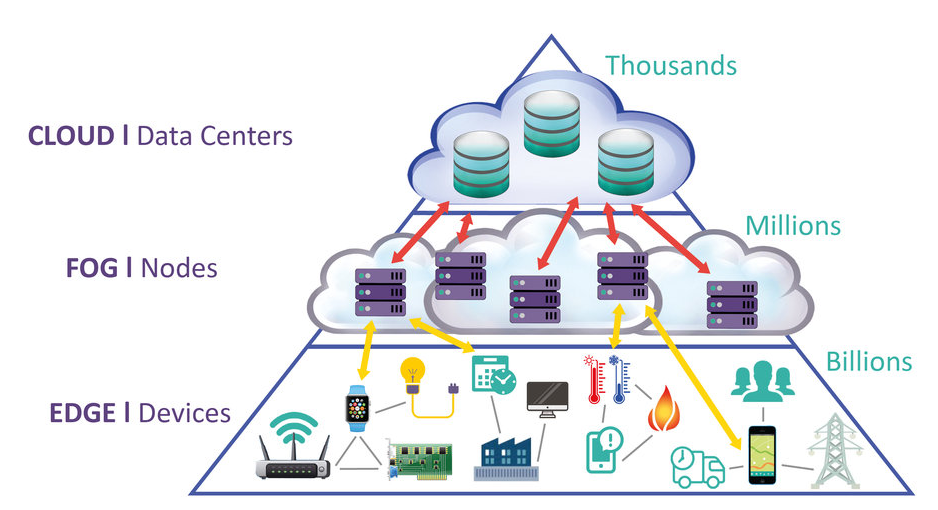
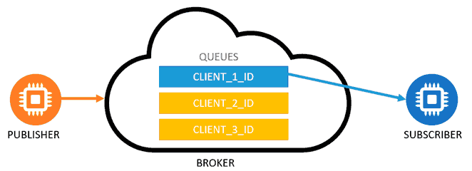

# Internet of Things

El Internet of Things, o Internet de las Cosaas, se refiere a M2M (Machine to Machine), es decir, máquinas que hablan con máquinas, pero usando Internet para comunicarse.

El IIoT es el Industrial IoT y está relacionado con el término de Industria 4.0.

Básicamente el IoT serían "Cosas", en este caso circuitos eléctricos con sensores y actuadores, que interaccionan con programas - otras cosas - personas.

La idea feliz de todo esto es que todo esté conectado a Internet y poder monitorizar e interactuar con todo. Ya sea tu lavadora, un invernadero, o la iluminación de una carretera.

## Arquitecturas

Arquitecturas para el IoT habrá miles distintas para cuando leas esto. Pero más o menos la "básica" para empezar se podría dividir en 3 capas:

1. Cloud:
    - Es la capa más alta y los elementos de esta serían servidores con aplicaciones web.
    - El número de elementos es el menor a las capas inferiores.
    - Aplicaciones típicas serían:
        - Plataformas de IoT como [ThingsBoard](https://thingsboard.io/)
        - Almacenamiento y procesamiento de datos (bases de datos).
        - Apps de backend
        - ...
2. Fog:
    - Es la capa intermedia y los elementos de esta se suelen llamar nodos.
    - Serían un Cloud pequeñito, ya que Fog es niebla, que básicamente es una nube baja.
    - El número de elementos es mayor a la capa Cloud pero inferior a la Edge.
    - Serían como los servidores / gateways que interaccionan directamente con las things y el cloud.
    - Aplicaciones típicas podrían ser [Node-Red](https://nodered.org/)
3. Edge
    - Es la capa más baja y los elementos son llamadas Things o cosas.
    - Está relacionada con el hardware / electrónica que conecta con los sensores y actuadores.
    - Es la capa con mayor número de elementos.
    - Aplicaciones típicas serían:
        - Placas ESPxx de ESPRESSIF
        - Frameworks como Arduino
        - Programación con herramientas como [ESPHome](https://esphome.io/)

Una imagen dela arquitectura típica sería esta (la imagen ha sido sacada de [esta web](https://leanbi.ch/en/blog/iot-and-predictive-analytics-fog-and-edge-computing-for-industries-versus-cloud-19-1-2018/))

Las arquitecturas pueden cambiar mas o menos, como que no exista la capa Fog.

Sea como sea la arquitectura, el tema es que estos proyectos (como cualquier otro) contienen una complejidad inherente. Donde se carga la complejidad depende del problema. Puede ser que la capa Edge tenga mucha complejidad, posibilitando que las capas superiores sean más livianas. Lo lógico es que la capa Edge sea muy simple, y por ende barata, y de ahí se va subiendo en complejidad.

Cuando la capa Edge genera mucha data, es probable que un proyecto de IoT derive en un proyecto de Big Data en la parte Cloud.

Hay más elementos que importan aquí y no hay desestimar, como es el tema de la seguridad.

## Paradigmas de Comunicación

> Recomiendo leer [este post](https://www.luisllamas.es/protocolos-de-comunicacion-para-iot/) de Luis Llamas. Las imágenes están sacadas de allí de hecho.

Al haber tal cantidad de dispositivos, distintos, y probablemente pensando en que se puedan añadir / quitar elementos sin que afecte a toda la arquitectura, el típico paradigma de comunicación **Cliente / Servidor** no es el más adecuado.

A partir de ahora el paradigma se cambia y habrá una centralita (lo que entendemos por servidor) llamada **Broker** donde se conectan los clientes. Unos clientes publicarán / producirán la información y otros clientes se suscribirán a ella o la consumirán. Digamos que pasamos a una forma de trabajar dirigida por eventos. Los protocolos para trabajar sobre estos nuevos paradigmas no son TCP/UDP ni HTTP, son distintos (aunque usarán esos por debajo).

Los dos nuevos grandes paradigmas de comunicación son:

1. Message Service -> La info que se manda al broker y no se lee, se pierde / se sobreescribre.
    
2. Message Queue -> La info que se manda al broker se almacena en colas que seran vaciadas conforme se lean.
    

Dentro de estos paradigmas, hay varios patrones de comunicaciones, pero los dos más conocidos son:

1. PubSub (Publisher Subscriber)
    - Digamos que en este patrón los clientes estan desacoplados.
    - El *subscriber* le dice al broker a que info se quiere subscribir.
    - El *publisher* publica la info sin saber quien la lee ni cuando.
    - Sería comunicación en un sentido solo.
2. RPC (Remote Procedure Call)
    - Sería lo más parecido al antiguo paradigma Cliente / Servidor, solo que con un broker por medio.
    - El cliente se llamaría *caller* y el servidor sería el *callee*.
    - El *callee* le diría al broker que procedimientos suyos se pueden usar (sería como el server exponiendo una API).
    - El *caller* invoca un elemento del *callee* a través del broker y recibe una respuesta.
    - Vaya es como si ejecutaras una función en un programa remoto y obtuvieras la respuesta.
    - La comunicación ahora sería en dos sentidos, como en cliente / servidor, peticion - respuesta.

Protocolos de IoT serían:

- [MQTT](https://mqtt.org/) (Message Queue Telemetry Transport)
    - Message Service + PubSub sobre TCP.
    - Erróneamente en el nombre pone MQ (de Queue), pero no usa colas, debería ser MSTT (Message Service Telemetry Transport).
    - El más usado y casi el estandar en la capa Edge, porque es muy liviano.
- [AMQP](https://www.amqp.org/) (Advanced Message Queuing Protocol)
    - Message Queue + PubSub / RPC sobre TCP.
    - El más usado para comunicar servicios.
    - No es tan liviano como MQTT, por eso no se suele usar en la capa Edge, y funciona sobre TCP.
- [STOMP](http://stomp.github.io/) (Streaming Text Oriented Messaging Protocol)
    - Message Service + PubSub sobre HTTP.
    - Es parecido a MQTT pero funciona sobre HTTP, no TCP.
    - No ha cuajado, y se podría decir que está en desuso.
- [CoAP](https://coap.technology/) (Constrained Application Protocol)
    - Cliente / Servidor sobre UDP.
    - Este protocolo lo menciono como protocolo de IoT pero no encaja mucho aquí, ni tampoco parece que cuaje mucho.
    - Siempre se le pone como alternativa a MQTT, ya que AMQP se piensa para capas distintas.
    - Usa el modelo de API Rest, sobre UDP, con dispositivos con pocos recursos.
    - No hay broker, sino que los clientes se comunican entre ellos usando a los demás clientes como gateways.

No se tienen porqué usar solo uno, por ejemplo entre Edge-Fog podrías usar MQTT y entre Fog-Cloud o entre servicios de Cloud usar AMQP. De hecho si la cantidad de things y servicios en el cloud son muchos, puede ser que incluso necesites un broker para comunicar distintos brokers.

## Brokers

Para Message Service el protocolo más usado es MQTT y se suele usar el broker [Mosquitto](https://mosquitto.org/).

Para Message Queue el protocolo más usado es AMQP y se suele usar el broker [RabbitMQ](https://www.rabbitmq.com/).

Para cuando necesitas comunicar brokers entre si, se suele usar [Apache Kafka](https://kafka.apache.org/).

Para crearte tu propio broker con su propio paradigma se comunicación, se suele usar la librería [ZeroMQ](https://zeromq.org/).
