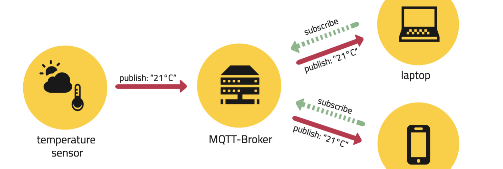

# MQTT

???+ tip "Lectura de ayuda chachi"
      Referencia -> [aquí](https://programarfacil.com/esp8266/mqtt-esp8266-raspberry-pi/)

MQTT es un protocolo de mensajería para IoT, que va montando sobre la capa TCP, pensado para comunicaciones M2M.

## Arquitectura

Se compone de dos elementos, **Broker** y **Clientes**

=== "Broker"
    - Es el único que sabe que cliente está suscrito a cada topic, luego los clientes son independientes.
    - Puede almacenar mensajes hasta que los lea el o los suscriptores.
=== "Cliente"
    - Cada cliente abre una conexión MQTT con el broker (algo asi como un socket).
    - Los hay de dos tipos: Publisher (manda mensajes) y Subscriber (recibe mensajes)

Consiste en el patrón Pub/Sub (publicación / suscripción):

- Normalmente solo un cliente publica en un topic dentro del broker.
- Un cliente o varios le dicen al broker a que topic se suscriben.

<figure markdown>
  
  <figcaption>Imagen sacada de <a src="https://borrowbits.com/2020/04/mqtt-vs-http-que-protocolo-es-mejor-para-iot/">aquí</a></figcaption>
</figure>

## Mensajes

Se envían mensajes asíncronamente. Del publisher al broker y del broker a los subscribers.

Básicamente la conexión de un cliente con el broker, es un socket TCP. Pero se permite también la conexión sobre WebSockets.

!!! info "Se puede usar en páginas web"
    Si usas MQTT sobre Websockets, entonces podrás conectar una página web por MQTT.

    AMQP no permite esto.

Para nosotros, consisten solo en **topic** + **payload**.

=== "Topic"
    - Sería como el endpoint en cliente / servidor.

=== "Payload"
    - Es el contenido del mensaje.
    - Es de tipo de tipo String.

??? abstract "Siendo rigurosos"
    Tienen 3 partes:

    1. Encabezado fijo -> 2B (2 Bytes), es obligatorio
    2. Encabezado variable -> 4b (4 bits), no es obligatorio.
    3. Mensaje (payload) -> Hasta 2-4 kB (teoricamente hasta 256MB).

Cada mensaje tiene también QoS, permitiendo información fiable (o no). Hay 3 grados de QoS:

=== "QoS 0"
    - Enviar solo 1 vez.
    - Puede que se pierda mensaje.
=== "QoS 1"
    - Permite al menos 1 reenvío.
    - Se garantiza entrega del mensaje, pero puede haber duplicidad.
=== "QoS 2"
    - Llega 1 vez.
    - Se garantiza que el mensaje llega 1 sola vez.

!!! warning "¿Porque no usamos solo QoS 2?"
    A mayor calidad, menos rendimiento.

### Topic

Un topic es el asunto / tema del mensaje.

Van jerarquizados, separados por `/` y dentro de categorías.

??? example "Definir un topic para tu tv del salón"
    - La thing sería `tv`
    - Está dentro de la categoría `salón`
    - Esta a su vez en la categoría `casa`
    - El topic podría ser `/casa/salon/tv`

Un cliente (o varios) se pueden suscribir a uno o varios topic. Existen dos operadores para ayudar a las suscripciones, `+` y `#`.

=== "Operador `+`"
    - Sustituye categorías / niveles intermedios
    - `/casa/+/tv` equivale a suscribirse a todos los topic `tv` de `/casa`
=== "Operador `#`"
    - Sustituye categorías / niveles inferiores
    - `/casa/#` equivale a Suscribirse a todos los topic de `/casa`

### Payload

Es una cadena de texto o strings.

!!! tip "Consejo: Mandar JSON"
    Una buena estrategia es que tu payload sea un JSON.

## MQTT Explorer

Se recomienda usar esta app para poder ver los topics y sus contenidos en un broker, ya sea mosquitto o no.

[MQTT Explorer](http://mqtt-explorer.com/ "Descárgatelo ya") está en Linux, Mac y Windows.

## Mosquitto

[Mosquitto](https://mosquitto.org/) es un broker Open Source y muy liviano para empezar.

Si se deseara un broker más potente, se recomienda [HiveMQ](https://www.hivemq.com/) o [VerneMQ](https://vernemq.com/).

### Broker

??? info "Docker para levantar Mosquitto"
    - Levantar con un contenedor docker, para no tener que instalar nada.
    - Toda la información de este contenedor está aquí -> [Contenedor eclipse-mosquitto](https://hub.docker.com/_/eclipse-mosquitto)

Abajo hay lo mínimo para poder levantar un Mosquitto:

- Se pueda usar desde fuera del Localhost (Mosquitto 2 por defecto no lo deja, hay que habilitarlo).
- Se han abierto los puertos 1883  para mqtt y 9001 para mqtt sobre websockets.
- Se pueden ver los logs que sucedan en cada comunicación.

=== "docker-compose.yml"

    ``` yaml
    version: '3'

    services:
    broker:
    image: 'eclipse-mosquitto:2'
    restart: always
    ports:
          - '1883:1883'
          - '9001:9001'
    volumes:
          - './mosquitto/config:/mosquitto/config'
          - './mosquitto/data:/mosquitto/data'
          - './mosquitto/log:/mosquitto/log'
    ```

=== "mosquitto.conf"

    ``` bash
    # Poder conectar desde fuera del localhost
    allow_anonymous true
    per_listener_settings true
    # Listeners
    listener 1883
    protocol mqtt
    listener 9001
    protocol websockets
    # Log
    log_type all
    connection_messages true
    log_timestamp true
    log_timestamp_format %Y-%m-%dT%H:%M:%S
    websockets_log_level 0
    ```

### Clientes

Con Mosquitto se puede usar cualquier cliente MQTT. Pero Mosquitto cuenta con clientes CLI. Para instalarlos basta  con

``` bash
sudo apt install mosquitto-clients
```

Ahora abrimos 2 terminales en el cliente, uno para ser usado como publisher y otro suscriber

=== "Subscriber `mosquitto_sub`"
    Comando para suscribirse a un topic:

    - `-h <broker>` indica el host / ip del broker.
    - `-t <topic>` indica el topic al que se va a suscribir.

    ``` bash
    mosquitto_sub -h <broker> -t <topic>
    ```

=== "Publisher `mosquitto_pub`"
    Comando para publicar en un topic:

    - `-h <broker>` idem que antes.
    - `-t <topic>` idem que antes.
    - `-m <mensaje>` mensaje que se envía al topic (debe ir entre comillas dobles).

    ``` bash
    mosquitto_pub -h <broker> -t <topic> -m <mensaje>
    ```

### Hola mundo

1. Supón que tienes el broker en la ip `192.168.1.110`.
2. Abre dos terminales, una para el subscriber y otra para el publisher.
3. En el subscriber te vas a subscribir a todos los topics.
4. Con la opción `-v` se puede ver a que topic procede el payload.
5. Con el publisher vas publicar en el topic `/casa/salon/temperatura` el mensaje `"Hola mundo, hace 25ºC"`.

=== "Suscriber"
    ```bash
    mosquitto_sub -v -h 192.168.1.110 -t /casa/salon/temperatura
    ```
=== "Publisher"
    ```bash
    mosquitto_pub -h 192.168.1.110 -t /casa/salon/temperatura -m "Hola mundo, hace 25ºC"
    ```
