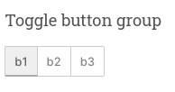
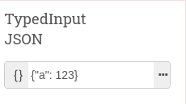
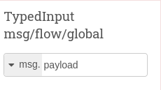
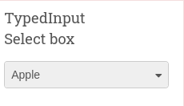
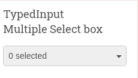
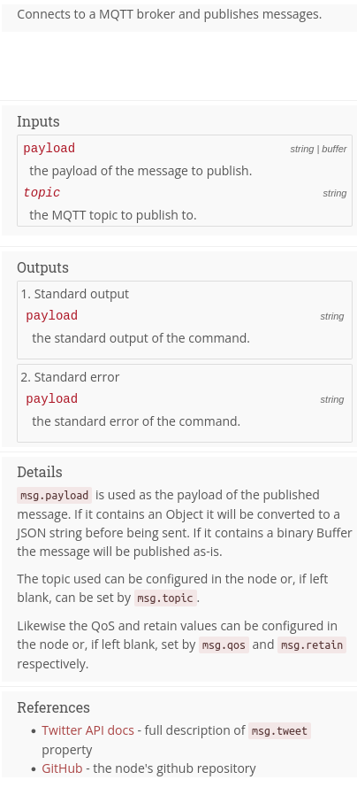
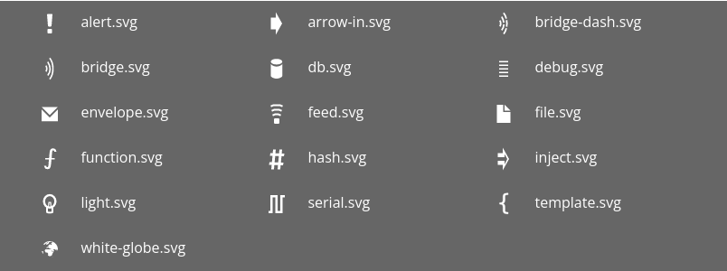
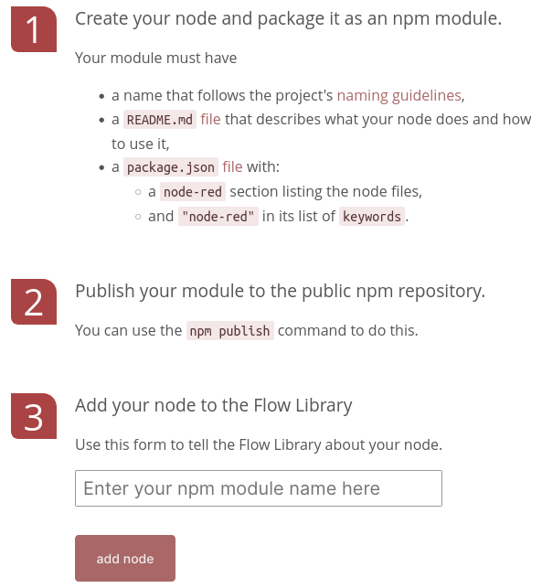

# Crear componentes

???+ info "Componente = nodo"

    Decir componente o nodo, es prácticamente lo mismo.

    El componente digamos que sería el concepto, el modelo, o la clase si hablaremos en un contexto de Programación Orientada a Objetos.

    El nodo sería una instancia, el objeto (en Programación Orientada a Objetos), lo que usamos.

    Luego un componente (modelo) puede tener muchos nodos (instancias).

Para crear componentes es necesario que esten en un repositorio para ser publicados como un paquete npm y luego añadidos
a la Node-Red library. Se pueden crear varios a la vez bajo el mismo paquete npm, sobre todo si quieres que se instalen juntos.

Hay solo dos tipos de componentes:

1. Tipo `config`
    - Son componentes que solo se pueden llamar desde la configuración de otros componentes.
    - Normalmente contienen lógica que necesita estar activa todo el rato, como una conexión mqtt por ejemplo.
2. Los demás
    - Son todos los componentes que se pueden poner en un flujo directamente.

Cada componente se compone (vaya juego de palabras eh) de al menos 3 ficheros:

1. `<component-name>.html` que indica toda la info que usa el componente.
2. `<component-name>.js` que contiene toda la lógica de funcionamiento del componente.
3. `package.json` donde esta definido como paquete npm.

Puede tener un icono, así que se recomienda añadir la carpeta `icons` en el mismo nivel de la jerarquía de ficheros.

???+ info "Ejemplo de estructura del repositorio"

    - `package.json`
    - `src`/ -> Código de los componentes
        - `icons`/ -> Iconos de los componentes
        - `resources/` -> Recursos que necesiten los componentes, como imágenes, ficheros extra JS, etc
        - `component-name1.html`
        - `component-name1.js`
        - `component-name2.html`
        - `component-name2.js`
        - ...
    - `tests/` -> Tests de cada componente
        - `component-name1_spec.js`
        - `component-name2_spec.js`
    - `examples/` -> Flujos de ejemplo de cada componente
        - `example-component-name1.json`
        - `example-component-name2.json`
        - ...

## Resumen muy simplificado de como crear un componente

1. Crea el **Fichero HTML** con al menos la **Definition** y el **Edit Dialog** (el **Help Text** es opcional).
   1. Pon especial foco en las propiedades del nodo -> `defaults` del **Definition**
   2. Genera en el **Edit Dialog** la forma de configurar esas propiedades del `defaults`
2. Crea el **Fichero JS** y recuerda que el parámetro de entrada son los `defaults` de la **Definition** del **Fichero HTML**
3. En el `package.json` añade la sección de `node-red` y especifíca donde está el **Fichero JS**.

???+ warning "Componentes juntos o separados"

    Puedes crear todos los componentes en un solo par de **Fichero HTML** + **Fichero JS**.

    No habría ningún problema ya que cada sección debe de tener un identificador único para cada componente.

    Personalmente yo recomendaría que fuesen en ficheros separados, para poder estructurar mejor todo.

    Pero tu decides, is up to you.

## Fichero HTML

El **Fichero HTML** indica de que se compone el nodo, como se configura, y demás.

Este se divide en tres partes:

1. Definition -> Definición
2. Edit dialog -> Configuración
3. Help text -> Información

!!! warning "Referenciar el componente en distintos sitios"

    Para referirnos tanto en el fichero **HTML** como en el **JS** al mismo nodo, **el identificador tiene que ser el mismo**.
    En el siguiente ejemplo hay que tener claro que `component-name` es el identificador
    único que va a tener el componente tanto en este fichero, como en el fichero Javascript.

``` html
<!-- Definition in JS -->
<script type="text/javascript">
    RED.nodes.registerType('component-name', {
        // Definition
    })
</script>

<!-- Edit dialog in HTML -->
<script type="text/html" data-template-name="component-name">
</script>

<!-- Help text in Markdown or HTML -->
<script type="text/markdown" data-help-name="component-name">
</script>
```

### Definition (Definición)

La Definición es un objeto JS dentro del `RED.nodes.registerType('component-name', { /* This is the definition */ } )`

???+ tip

    Componente tipo config -> `category: 'config'`

    Componente normal -> `category: 'lo-que-sea'`

Este objeto contiene los siguientes campos.

???+ info "Definición"

    | Propiedad         | Tipo                  | Descripción                                                                     |
    | :---------------: | :-------------------: | :------------------------------------------------------------------------------ |
    | `category`        | `string`              | Categoría que aparece en la Paleta                                              |
    | `defaults`        | `object`              | Propiedades del nodo para el **Fichero JS** y también del **Edit Dialog**       |
    | `credentials`     | `object`              | Credenciales del nodo                                                           |
    | `inputs`          | `number`              | Entradas, solo `0` o `1`                                                        |
    | `outputs`         | `number`              | Salidas, `0` o más                                                              |
    | `icon`            | `string`              | Icono                                                                           |
    | `color`           | `string`              | Color de fondo                                                                  |
    | `label`           | `string` - `function` | Etiqueta para el Panel                                                          |
    | `paletteLabel`    | `string` - `function` | Etiqueta para la Paleta                                                         |
    | `labelStyle`      | `string` - `function` | Estilos para la etiqueta del Panel                                              |
    | `inputLabels`     | `string` - `function` | *¡Opcional!* Etiqueta para el hover el puerto de entrada                        |
    | `outputLabels`    | `string` - `function` | *¡Opcional!* Etiqueta para el hover de los puestos de salida                    |
    | `align`           | `string`              | Alineamiento del icono y la etiqueta                                            |
    | `button`          | `object`              | Añadir un botón al final (como en el TypedInput - JSON)                         |
    | `oneditprepare`   | `function`            | Llamada cuando se está construyendo el **Edit Dialog**                          |
    | `oneditsave`      | `function`            | Llamada cuando se aprieta el botón Save en el **Edit Dialog**                   |
    | `oneditcancel`    | `function`            | Llamada cuando se aprieta el botón Cancel en el **Edit Dialog**                 |
    | `oneditdelete`    | `function`            | Llamada cuando se borra algo de la configuración del nodo en el **Edit Dialog** |
    | `oneditresize`    | `function`            | Llamada cuando se cambia el tamañao del **Edit Dialog**                         |
    | `onpaletteadd`    | `function`            | Llamada cuando se añade el tipo del módulo a la Paleta                          |
    | `onpaletteremove` | `function`            | Llamada cuando se quita el tipo del módulo de la Paleta                         |

### Edit Dialog (Configuración)

La parte de Confifguración es para el cuadro de configuración del componente o **Edit Dialog**.

Es una sección HTML que tiene que tener el atributo `data-template-name`.

```html
<script type="text/html" data-template-name="node-type">
    <!-- edit dialog content  -->
</script>
```

Normalmente se compone de una serie de *rows*. Cada una de estas es un elemento
`<div class="form-row">` donde cada una de estas contiene un `<label>` (para el nombre del
de la propiedad a configurar) y otro elemento para introducir el valor que va a tener esa propiedad, como por
ejemplo un `<input>`.

!!! warning "Identificar propiedades"

    Para comunicar esto con la Definición (propiedad del objeto `defaults`) así como el fichero Javascript (objeto de entrada
    en la función del nodo), se tiene que poner cada `id` como `node-input-<property>`. Por ejemplo si el nodo va a tener una
    propiedad `name`, aquí se debe de poner `id="node-input-name"`,

```html
<div class="form-row">
    <label for="node-input-name"><i class="fa fa-tag"></i> Name</label>
    <input type="text" id="node-input-name" placeholder="Name">
</div>
```

Si se quiere introducir un icono, hay que usar `<i>` con los iconos de [Font Awesome 4.7](https://fontawesome.com/v4.7.0/icons/).

Para insertar el dato, Node-Red te provee distintos widgets para usar;

#### Buttons

Los buttons necesitan usar la clase `red-ui-button` y luego añadir alguna más para modificar
el tipo de UI.

El **toggle button requiere** que además se añada **lógica** a la parte de **Definición**

=== "Button"

    

    ```html
    <button type="button" class="red-ui-button">Button</button>
    ```

=== "Small Button"

    

    ```html
    <button type="button" class="red-ui-button red-ui-button-small">Button</button>
    ```

=== "Toggle Button group"

    

    !!! warning "Nota"
    
        Es probable que la parte de HTML del `<span></span>` tenga que ir todo en una línea
        y sin espacios en blanco entre medias, porque sino Node-Red no sabe renderizarlo.

    ```html title="Configuración"
    <span class="button-group">
        <button type="button" class="red-ui-button toggle selected my-button-group">b1</button>
        <button type="button" class="red-ui-button toggle my-button-group">b2</button>
        <button type="button" class="red-ui-button toggle my-button-group">b3</button>
    </span>
    ```

    ```javascript title="Definición"
    $(".my-button-group").on("click", function() {
        $(".my-button-group").removeClass("selected");
        $(this).addClass("selected");
    })
    ```

#### Inputs

Al igual que con los `<button>`, hay `<input>` tuneados, pero esos no depende de una clase,
sino que son un tipo especial que son los `TypedInput` que tienen su propia API -> [TypedInput API](https://nodered.org/docs/api/ui/typedInput/).

=== "Input"

    

    ```html
    <input type="text" id="node-input-name">
    ```

=== "TypedInput -> String/Number/Boolean"

    

    Cuando el `TypedInput` puede tener distintos tipos de valores, hay que añadir
    el segundo elemento `hidden` para poder almacenar que tipo contiene.

    ```html title="Configuración"
    <input type="text" id="node-input-example1">
    <input type="hidden" id="node-input-example1-type">
    ```

    ```javascript title="Definición -> oneditprepare"
    $("#node-input-example1").typedInput({
        type:"str",
        types:["str", "num", "bool"],
        typeField: "#node-input-example1-type"
    })
    ```

=== "TypedInput -> JSON"

    

    ```html title="Configuracion"
    <input type="text" id="node-input-example2">
    ```

    ```javascript title="Definición -> oneditprepare"
    $("#node-input-example2").typedInput({
        type:"json",
        types:["json"]
    })
    ```

=== "TypedInput -> msg/flow/global"

    

    ```html title="Configuracion"
    <input type="text" id="node-input-example3">
    <input type="hidden" id="node-input-example3-type">
    ```

    ```javascript title="Definición -> oneditprepare"
    $("#node-input-example3").typedInput({
        type:"msg",
        types:["msg", "flow","global"],
        typeField: "#node-input-example3-type"
    })
    ```

=== "TypedInput -> Select box"

    

    ```html title="Configuracion"
    <input type="text" id="node-input-example4">
    ```

    ```javascript title="Definición -> oneditprepare"
    $("#node-input-example4").typedInput({
        types: [
            {
                value: "fruit",
                options: [
                    { value: "apple", label: "Apple"},
                    { value: "banana", label: "Banana"},
                    { value: "cherry", label: "Cherry"},
                ]
            }
        ]
    })
    ```

=== "TypedInput -> Multiple Select box"

    

    El resultado de un multi-select es una lista separada por comas con lo seleccionado.

    ```html title="Configuracion"
    <input type="text" id="node-input-example5">
    ```

    ```javascript title="Definición -> oneditprepare"
    $("#node-input-example5").typedInput({
        types: [
            {
                value: "fruit",
                multiple: "true",
                options: [
                    { value: "apple", label: "Apple"},
                    { value: "banana", label: "Banana"},
                    { value: "cherry", label: "Cherry"},
                ]
            }
        ]
    })
    ```

#### Multi-line Text Editor

El editor de texto multilínea es un widget sacado del editor [Monaco](https://microsoft.github.io/monaco-editor/) o [Ace](https://ace.c9.io/) (dependiendo cual tengas activado en las settings).

Para generarlo debes usar `<div class="node-text-editor" id="editor-id"></div>`, pero deberías de añadirle unas dimensiones
para que no se vaya de madre.

Se inicializa con el `oneditprepare` de la Definición y con `oneditsave` y `oneditcancel` obtienes el valor cuando se cierra
el editor.


```html title="Configuración"
<div style="height: 250px; min-height:150px;" class="node-text-editor" id="node-input-example-editor"></div>
```

```javascript title="Definición"
oneditprepare: function() {
    this.editor = RED.editor.createEditor({
    id: 'node-input-example-editor',
    mode: 'ace/mode/text',
    value: this.exampleText
    });
},
oneditsave: function() {
    this.exampleText = this.editor.getValue();
    this.editor.destroy();
    delete this.editor;
},
oneditcancel: function() {
    this.editor.destroy();
    delete this.editor;
},
```

### Help Text (Información)

La parte de Información es para la documentación que se puede ver desde el editor, en la pestaña
de información.

Es un `<script></script>` HTML **o Markdown** que tiene que tener el atributo `data-help-name`.

=== "HTML"

    ```html
    <!-- Documentación -->
    <script type="text/html" data-help-name="component-name">
        <p>Esto va a ser el tooltip que aparezca cuando haces <code>hover</code> con el ratón sobre el componente</p>
        <!-- HTML Documentación -->
    </script>
    ```

=== "Markdown"

    ```html
    <!-- Documentación -->
    <script type="text/markdown" data-help-name="component-name">
        Esto va a ser el tooltip que aparezca cuando haces <code>hover</code> con el ratón sobre el componente
        <!-- Markdown Documentación -->
    </script>
    ```

La estructura es más o menos la siguiente:

1. Un párrafo corto que describa el componente -> Esto servirá de tooltip cuando se haga hover con el ratón.
2. Sección de **Inputs**
3. Sección de **Outputs**
4. Sección de **Details**
5. Sección de **References**

???+ tip "Notas a tener en cuenta"

    - Markdown es mucho más sencillo / menos verboso
    - Cuando vayas a referirte a una propiedad de `msg` y no a ser dentro de una lista específicara para eso, usa `<code></code>`.
    - No uses `<b>`, `<i>` y otro etiquetas de marcado que no se describan más abajo.

#### Secciones

Cada sección se marca con un título 3 `<h3>` y las subsecciones con título 4 (o inferior) `<h4>`.

=== "HTML"

    ```html
    <h3>Seccion</h3>

    <h4>Subsección</h4>
    ```
=== "Markdown"

    ```markdown
    ### Sección

    #### Subsección
    ```

#### Propiedades del msg

Para definir las propiedades del mensaje, hay que usar `<dl class="message-properties">`.

Por cada propiedad debe de haber un par de elementos `<dt>` y `<dd>`

Cada `<dt>` contiene el nombre de la propiedad y opcionalmente un `<span class="property-type">` con el tipo.
Si la propiedad es opcional se pone como `<dt class="optional">`

El `<dd>` solo contiene una breve descripción

=== "Resultado"

    

=== "HTML"

    ```html
    <dl class="message-properties">
        <dt>payload
            <span class="property-type">string | buffer</span>
        </dt>
        <dd> the payload of the message to publish. </dd>
        <dt class="optional">topic
            <span class="property-type">string</span>
        </dt>
        <dd> the MQTT topic to publish to.</dd>
    </dl>
    ```

=== "Markdown"

    ```markdown
    : payload (string | buffer) :  the payload of the message to publish.
    : *topic* (string)          :  the MQTT topic to publish to.
    ```

#### Más de una salida

Si el componente solo tiene una salida, solo debe de llevar el elemento `<dl>` como en el punto anterior.

Per si tiene más de una salida, esa lista debe de ir envuelta con un elemento `<ol class="node-ports">`.
Ahora cada elemento de la lista debe ir con su correspondiente `<dl>`.

=== "Resultado"

    

=== "HTML"

    ```html
    <ol class="node-ports">
        <li>Standard output
            <dl class="message-properties">
                <dt>payload <span class="property-type">string</span></dt>
                <dd>the standard output of the command.</dd>
            </dl>
        </li>
        <li>Standard error
            <dl class="message-properties">
                <dt>payload <span class="property-type">string</span></dt>
                <dd>the standard error of the command.</dd>
            </dl>
        </li>
    </ol>
    ```

=== "Markdown"

    ```markdown
    1. Standard output
    : payload (string) : the standard output of the command.

    2. Standard error
    : payload (string) : the standard error of the command.
    ```

#### Ejemplo completo con todo

=== "Resultado"

    

=== "Ejemplo completo Markdown"

    ```html
    <script type="text/markdown" data-help-name="node-type">
        Connects to a MQTT broker and publishes messages.

        ### Inputs

        : payload (string | buffer) :  the payload of the message to publish.
        : *topic* (string)          :  the MQTT topic to publish to.


        ### Outputs

        1. Standard output
        : payload (string) : the standard output of the command.

        2. Standard error
        : payload (string) : the standard error of the command.

        ### Details

        `msg.payload` is used as the payload of the published message.
        If it contains an Object it will be converted to a JSON string before being sent.
        If it contains a binary Buffer the message will be published as-is.

        The topic used can be configured in the node or, if left blank, can be set
        `msg.topic`.

        Likewise the QoS and retain values can be configured in the node or, if left
        blank, set by `msg.qos` and `msg.retain` respectively.

        ### References

        - [Twitter API docs]() - full description of `msg.tweet` property
        - [GitHub]() - the nodes github repository
    </script>
    ```

=== "Ejemplo completo HTML"

    ```html
    <script type="text/html" data-help-name="node-type">
        <p>Connects to a MQTT broker and publishes messages.</p>

        <h3>Inputs</h3>
            <dl class="message-properties">
                <dt>payload
                    <span class="property-type">string | buffer</span>
                </dt>
                <dd> the payload of the message to publish. </dd>
                <dt class="optional">topic <span class="property-type">string</span></dt>
                <dd> the MQTT topic to publish to.</dd>
            </dl>

        <h3>Outputs</h3>
            <ol class="node-ports">
                <li>Standard output
                    <dl class="message-properties">
                        <dt>payload <span class="property-type">string</span></dt>
                        <dd>the standard output of the command.</dd>
                    </dl>
                </li>
                <li>Standard error
                    <dl class="message-properties">
                        <dt>payload <span class="property-type">string</span></dt>
                        <dd>the standard error of the command.</dd>
                    </dl>
                </li>
            </ol>

        <h3>Details</h3>
            <p><code>msg.payload</code> is used as the payload of the published message.
            If it contains an Object it will be converted to a JSON string before being sent.
            If it contains a binary Buffer the message will be published as-is.</p>
            <p>The topic used can be configured in the node or, if left blank, can be set
            by <code>msg.topic</code>.</p>
            <p>Likewise the QoS and retain values can be configured in the node or, if left
            blank, set by <code>msg.qos</code> and <code>msg.retain</code> respectively.</p>

        <h3>References</h3>
            <ul>
                <li><a>Twitter API docs</a> - full description of <code>msg.tweet</code> property</li>
                <li><a>GitHub</a> - the nodes github repository</li>
            </ul>
    </script>
    ```

## Fichero JS

El **Fichero JS** indica el comportamiento del componente cuando está en funcionamiento.

Para crear un componente el esqueleto es como el que sigue:

1. Hay que exportar una función que reciba como parámetro el objeto global / runtime, Node-Red (en el ejemplo, `RED`).
2. Luego tiene que haber una función donde se le va a pasar como argumento su configuración proveniente del **Fichero HTML** (el `config` en el ejemplo).
3. Luego lo siguiente que hay que hacer es cargar el `this` con su configuración a través de `RED.Nodes.createNode()`
4. Después vendría la lógica del componente.
5. Por último, fuera de la función del módulo, hay que registrar el identificador del componente (el string usado en el Fichero HTML) con la función creada a través de `RED.nodes.registerType()`

```javascript title="Esqueleto de un componente en JS"
module.exports = function(RED) {
    function SampleNode(config) {
        RED.nodes.createNode(this, config);
        // component logic
    }

    RED.nodes.registerType("sample", SampleNode);
}
```

!!! tip "Renombrar el this"

    Una práctica común dentro de la lógica del componente es renombrar el `this` como `node`, para saber que te refieres al nodo

    ```javascript
    const node = this;
    ```

    Para las subsecciones siguientes, si ves `node` piensa que es el `this`. 

### Leer y enviar mensajes

Para leer mensajes, hay que habilitar el evento de `input` y pasarle una función `listener` 3 parámetros:

1. El primero es el mensaje de entrada.
2. El segundo es la función para enviar el mensaje.
3. El tercero es un parametro opcional, que sirve para terminar el envío si el módulo envía mensajes asíncronamente.

```javascript
node.on('input', function(msg, send, done) {
    // do something with 'msg'

    // Once finished, call 'done'.
    // This call is wrapped in a check that 'done' exists
    // so the node will work in earlier versions of Node-RED (<1.0)
    if (done) {
        done();
    }
});
```

En cambio para enviar mensajes tienes dos opciones:

- Que no dependan de las entradas -> Se mandan directamente
- Que dependan de las entradas -> Hay que mandarlas a través de la función `listener` anterior.

```javascript
const node = this;
// Salida que no depende de la entrada
const msg = { payload: "salida sin entrada" }
node.send(msg);
// Salida que depende de la entrada
node.on('input', function(msg, send, done) {
    // Comprobar que existe la función send para retrocompatibilidades de Node-Red
    send = send || function() { node.send.apply(node,arguments) }
    // Preparar el mensaje
    msg.payload = "salida con entrada";
    send(msg);
    // Acabar el envío
    if (done) {
        done();
    }
});
```

Independientemente de como sean las salidas (dependiente de entradas o no), hay que tener en cuenta
que Node-Red permite tener múltiple salidas y múltiples mensajes

- Más de una salida -> `node.send([msg1, msg2, msg3])`
- Mas de un mensaje por salida -> `node.send([msg1, [msg2A, msg2B], msg3])`

Si tu salida depende de la entrada, y solo vas a modificar el mensaje, procura reenviar
el objeto `msg` modificado y no crear uno nuevo.

Si el `msg` es `null`, aunque llames a `send(msg)`, este no se enviará.

### Trabajar con contexto

Como ya sabrás, en Node-Red puedes trabajar con 3 tipos de contextos:

- Contexto del Nodo -> Objeto `context` en los nodos `function`: Es la información almacenada en el nodo.
- Contexto del Flujo -> Objeto `flow` en los nodos `function`: Es la información almacenada en el flujo.
- Contexto Global -> Objeto `global` en los nodos `function`: Es la información almacenada global.

Para poder usar esto desde el **Fichero JS** es tan sencillo como usar:

- `node.context()` -> Contexto del nodo
- `node.context().flow` -> Contexto del Flow
- `node.context().global` -> Contexto Global

Cada uno de los contextos tienen sus funciones típicas `set` / `get` para guardar y leer información.

```javascript
// Node
const nodeContext = this.context();

nodeContext.set('data', 1)
node.log(nodecontext.get('data'))
// Flow
const flowContext = this.context().flow;

flowContext.set('data', 'say h')
node.log(flowContext.get('data'))
// Global
const globalContext = this.context().global;

globalContext.set('data', { hi: 'hello' })
node.log(globalContext.get('data'))
```

???+ note "Componententes `config` y contexto"

    Los nodos de configuración que son utilizados y son compartidos por otros nodos, son globales por defecto. A menos
    que el usuario del nodo especifique lo contrario.
    
    En tal caso, no se puede suponer que tengan acceso al contexto del Flow.

### Logging y gestión de errores

Para poder tener mensajes de logs, el propio componente nos provee ya de estas funciones:

```javascript
// Since Node-RED 0.17
node.trace("Log para comprobar cosas internas en el desarrollo, no para producción");
node.debug("Log para detalles de debuggear el nodo, no para producción");
// Before Node-RED 0.17
node.log("Log de información");
node.warn("Log de warning para advertir que algo posiblemente malo está pasando");
node.error("Log de errores");
```

También se pueden propagar errores para ser estudiados desde el **Flow** posteriormente.
Para ello hay que pasar el error a la función `done()`, pero por retrocompatibilidad,
si esta función no existe, hay que usar `node.error()`.

```javascript
let node = this;

node.on('input', function(msg, send, done) {
    // do something with 'msg'

    // If an error is hit, report it to the runtime
    if (err) {
        if (done) {
            // Node-RED 1.0 compatible
            done(err);
        } else {
            // Node-RED 0.x compatible
            node.error(err, msg);
        }
    }
});
```

### Status

Se puede definir el status del componente, sobre todo como ayuda visual en el **Flow**: para ver si está conectado, desconectado, etc.

???+ tip "El status es más importante de lo que crees"

    El status del componente no solo es algo visual para el editor. El estado de un componente
    se puede capturar con el componente `Status` que te permite averiguar si por ejemplo un
    componente concreto ha perdido la conexión, o se ha conectado.

    **Ponle especial cariño al estado de tu componente**

Para setearlo hay que usar la función `status()` y pasarle un objeto que contenga

| Propiedad | Valor | Descripción |
| :- | :- | :- |
| `shape` | `ring` - `dot` | Forma con la que mostrar el status |
| `fill` |  `red` - `green` - `yellow` - `blue` - `grey` | Color con el que mostrar el status |
| `text` |  | Texto a mostrar en el status |

```javascript title="Ejemplos de status"
node.status({
    shape: "ring",
    fill: "red",
    text: "disconnected"
});
// ...
node.status({
    shape: "dot",
    fill: "green",
    text: "connected"
});
```

### Cerrando el componente

Cada vez que se hace un nuevo `deploy` de los flujos, todos los componentes se borran. Luego es importante que si nuestro
componente almacena algún estado / conexión / event listener, sea removido antes de borrar el componente. Para esto hay
que usar otra función `listener` para el evento `close`. Dependiendo de como funcione el nodo, esta función tiene más
o menos parametros:

- Nodo síncrono: No tiene ningun parámetro
- Nodo síncrono: Tiene como parámetro la función `done`
- Nodo síncrono desde Node-Red 0.17: Tiene como parámetros una variable booleana que indica si ha sido deshabilitado ya o no y la función `done` de antes.

=== "Nodo síncrono"

    ```javascript
    node.on('close', function() {
        // tidy up any state
    });
    ```

=== "Nodo asíncrono"

    ```javascript
    this.on('close', function(done) {
        doSomethingWithACallback(function() {
            done();
        });
    });
    ```

=== "Nodo asíncrono desde Node-Red 0.17"

    ```javascript
    node.on('close', function(removed, done) {
        if (removed) {
            // This node has been disabled/deleted
        } else {
            // This node is being restarted
        }
        done();
    });
    ```

???+ warning "OJO con los componentes asíncronos"

    Si el **componente** es **asíncrono** y no se llama a la función `done` hay **problemas**:

    - **Antiguamente esperaba 15 segundos**, y si no se había llamado, se lanzaba el error y se **reiniciaba el flujo**.
    - **Ahora** se queda **esperando indefinidamente**, lo que **bloquearía** todo tu **Node-Red**.

## package.json

Antes se publicaban los paquetes como `node-red-contrib-<paquete>`. Pero ahora debe ser `@<scope>/<paquete>`
o en su defecto `@<scope>/node-red-<paquete>`:

- `@<scope>` el usuario / organizacion / grupo con el que se va a publicar el paquete.
- `<paquete>` es el nombre del paquete.

El fichero `package.json` está en la parte más alta del repositorio y se trabaja con él como con cualquier paquete npm.
Lo que hay que tener en cuenta para definir los componentes es que se tiene que añadir el apartado `"node-red"`:

- `"version"`: Indica la versión mínima de Node-Red que soportan los componentes
- `"nodes"`: Indica los componentes que hay en el paquete y se apunta al fichero `.js` del componente.

```json title="package.json"
{
    "name"         : "@<scope>/node-red-<paquete>",
    "version"      : "0.0.1",
    "description"  : "A sample node for node-red",
    "dependencies": {},
    "keywords": [
        "node-red"
    ],
    "node-red"     : {
        "version": ">=2.0.0",
        "nodes": {
            "component-name1": "src/component-name1/component-name1.js",
            "component-name2": "src/component-name2/component-name2.js",
            ...
        }
    }
}
```

## Propiedades del Nodo

Las propiedades de un nodo se definen de la forma siguiente:

1. Fichero HTML -> Definition -> `defaults` -> Se indican las propiedades que tiene el node (valor por defecto, tipo, etc).

    ```javascript title="Fichero HTML - Definition"
    defaults: {
        name: { value: "" },
        prefix: {value: "" }
    },
    ```

2. Fichero HTML -> Edit Dialog -> Se crean los componentes HTML con el `id="node-input-<property>"` para poder configurar cada una de las propiedades.

    ```html title="Fichero HTML - Edit Dialog"
     <div class="form-row">
        <label for="node-input-prefix"><i class="fa fa-tag"></i> Prefix</label>
        <input type="text" id="node-input-prefix">
    </div>
    ```

3. Fichero JS -> En el parámetro de entrada de la función (en los ejemplos `config`), ese es el objeto con las propiedades ya configuradas por el usuario en el **Edit Dialog**.

    ```javascript title="Fichero JS"
    function ExampleNode(config) {
        RED.nodes.createNode(this, config);
        this.prefix = config.prefix;
        var node = this;
        this.on('input', function(msg) {
            msg.payload = node.prefix + msg.payload.toLowerCase();
            node.send(msg);
        });
    }
    ```

### Propiedades en el Fichero HTML - Definition

Las propiedades configurables por el usuario se definen dentro del `defaults`. Hay algunas que estan reservadas y no se pueden usar:

- Propiedades con un único carácter (Node-Red si que usa estas internamente `x`, `y`, `z`, `d`, `g`, `l`)
- Palabras reservadas `id`, `type`, `wires`, `inputs`.
- La palabra `outputs` es reservada, pero si se pone permite que el usuario pueda editar el número de salidas

Cada una de estas propiedades dentro del `defaults` es un objeto con las siguientes propiedades:

| Propiedad  | Tipo       | Opcional | Descripción |
| :--------- | :--------: | :------: | :---------- |
| `value`    | `any`      |          | Valor por defecto |
| `required` | `boolean`  | x        | Si el parámetro es obligatorio (`false` por defecto) |
| `validate` | `function` | x        | Función para validar que el valor es correcto (Node-Red por defecto tiene varias como `RED.validators.number()` o `RED.validators.regex()`) |
| `type`     | `string`   | x        | Si necesita usar un nodo de tipo configuración para funcionar, hay que especificar aquí el identificador |

Para validar las propiedades , aparte del `required`, existe el campo `validate`. Este permite pasar un una función que
devuelva un boolean para validar que se cumpla que el dato sea como tiene que ser.

Node-Red por defecto te da dos (hay otra extra, pero ese no hace falta usarlo, es para los `TypedInput`)

- `RED.validators.number()` comprueba que el valor de la propiedad sea un número.
- `RED.validators.regex()` comprueba que el valor cumpla una expresión regular.

Un ejemplo podría ser este

``` javascript
defaults: {
    minimumLength: { 
        value: 0,
        validate: RED.validators.number()
        },
    lowerCaseOnly: {
        value: "",
        validate: RED.validators.regex(/[a-z]+/)
    },
    custom: {
        value: "",
        validate: function(v) {
            const minimumLength = $("#node-input-minimumLength").length ? $("#node-input-minimumLength").val() : this.minimumLength;
            return v.length > minimumLength
        }
    }
},
```

Las demás propiedades que no van en `defaults` son para definir como es el componente. Aunque si se necesita modificar el
comportamiento por defecto, también se puede customizar usando las propiedades. Estas son propiedades de tipo función,
donde se les pasa una función para que sea ejecutada en cierto momento.

- `oneditprepare`: Es llamada inmediatamente antes de renderizar / mostrar el **Edit Dialog**.
- `oneditsave`:  Es llamada después de darle a `Done` (guardar) en el **Edit Dialog**.
- `oneditcancel`: Es llamada después de darle a `Cancel` (cancelar) en el **Edit Dialog**.
- `oneditdelete`: Es llamada después de darle a `Delete` (borrar) en el **Edit Dialog**.
- `oneditresize`: Es llamada cuando se redimensiona el **Edit Dialog**.

Puedes comprobar los campos, añadir opciones al UI del Edit Dialog, etc. Un ejemplo es el módulo `Inject` que cambia la UI
cuando le das algún tipo de frecuencia a la inyección. Puedes mirar el código para ver como usa estas funciones:

- `oneditprepare` -> [código](https://github.com/node-red/node-red/blob/fe3626035c9423fa651d905bd0a6aaa0fb5959da/packages/node_modules/%40node-red/nodes/core/common/20-inject.html#L373C13-L373C13)
- `oneditsave` -> [código](https://github.com/node-red/node-red/blob/fe3626035c9423fa651d905bd0a6aaa0fb5959da/packages/node_modules/%40node-red/nodes/core/common/20-inject.html#L607C9-L607C9)

### Propiedades en el Fichero HTML - Edit Dialog

Cuando se abre el **Edit Dialog**, el editor busca que haya por cada elemento del `defaults`, un `<input>` que contenga un
`id`:

- `id="node-input-<property>"` para propiedades normales.
- `id="node-input-config-property>"` para propiedades que corresponden a nodos de tipo configuración.

Cada uno de estos `<input>` son configurados al valor por defecto que tienen en el `defaults`.

### Propiedades en el Fichero JS

Cada componente en el Fichero JS recibe un parámetro de entrada, normalmente se llama `config` en la docu oficial. Esto es así
porque realmente lo es. Esa configuración es un objeto que contiene las propiedades mencionadas en el `defaults` de la Definition
y configuradas en el Edit Dialog.

### Propiedades en el settings.js

También se pueden exponer propiedades del nodo en el `settings.js` pero para eso se necesita que se sigan unas reglas:

- El nodo debe de no requerir que el usuario lo configure -> Luego tiene que tener un valor por defecto.
- El nombre de la propiedad en el `settings.js` debe tener como prefijo el identificador del nodo.
- El nombre debe ir en camelCase.

Ejemplo fácil:

- En mi nodo `sample-node` quiero poder editar la propiedad `colour`.
- En el `settings.js` tengo que definir la propiedad como `sampleNodeColour`.
- Ahora el runtime puede referenciar a esta propiedad como `RED.settings.sampleNodeColour`

Estas propiedades del `settings.js` también se pueden exponer para el usuario. Para ello hay que registrarlas en el **Fichero JS**.

En el `RED.nodes.registerType()` hay que pasar un tercer parámetro. Este es un objeto que contiene otro objeto `settings`, donde
se le pasa cada propiedad con el nombre del `settings.js` y dentro contiene un objeto con las propiedades

- `value`: Valor por defecto de la propiedad
- `exportable`: Tiene que estar fijada a `true` para decirle al runtime que es editable desde el editor.

Siguiendo con el ejemplo anterior, en el **Fichero JS** habría que añadir esto:

```javascript
RED.nodes.registerType("sample", SampleNode, {
    settings: {
        sampleNodeColour: {
            value: "red",
            exportable: true
        }
    }
});
```

Ahora `RED.settings.sampleNodeColour` también será accesible desde el editor.

### Credenciales

Hay un tipo especial de propiedades que son las `credentials`. Estas normalmente se usan para algún tipo de conexión, así que
se almacenan a parte del main Flow y no se pueden exportar desde el editor. Por eso en el **Definition** del **Fichero HTML** no
van dentro del `defaults` y tienen su propio campo.

Para definirlas hay que seguir estos 3 pasos:

1. **Fichero HTML** -> **Definition** -> `credentials`: las entradas solo pueden tener un type de tipo `text` o `password`.

    ```html
    <script type="text/javascript">
        RED.nodes.registerType('component-name', {
            // Definition
            credentials: {
                username: { type: "text" },
                password: { type: "password" }
            },
        })
    </script>
    ```

2. **Fichero HTML** -> **Edit Dialog**: Usar el mismo convenio que para las propiedades dentro del `defaults`, es decir, `node-input-<property>`.

    ```html
    <div class="form-row">
        <label for="node-input-username"><i class="fa fa-tag"></i> Username</label>
        <input type="text" id="node-input-username">
    </div>
    <div class="form-row">
        <label for="node-input-password"><i class="fa fa-tag"></i> Password</label>
        <input type="password" id="node-input-password">
    </div>
    ```

3. **Fichero JS** -> `RED.nodes.registerType()`: En el tercer parámetro, igual que en las propiedades el `settings.js`, añade un apartado para `credentials`.

    ```javascript
     RED.nodes.registerType("my-node", MyNode, {
        settings: {...},
        credentials: {
            username: { type: "text" },
            password: { type: "password" }
        }
    });
    ```

Con las credenciales se puede trabajar desde el runtime (la lógica dentro del **Fichero JS**). Una vez cargado el objeto del nodo,
se puede acceder directamente con la propiedad `credentials`. En este ejemplo se puede ver bien.

```javascript
function MyNode(config) {
    RED.nodes.createNode(this,config);
    const node = this;
    const username = node.credentials.username;
    const password = node.credentials.password;
    // ...
}
```

Con el editor (las secciones del **Fichero HTML**), el nodo tiene restringido el acceso a las credenciales.
Las credenciales de tipo `text` si se pueden leer como en el runtime, pero las de tipo `password` no.
En su lugar hay que usar la propiedad `has_<property>` para saber si está vacía o no

```html
<script type="text/javascript">
    RED.nodes.registerType('component-name', {
        // Definition
        credentials: {
            username: { type: "text" },
            password: { type: "password" }
        },
        // ...
        oneditprepare: function() {
            // this.credentials.username     -> available
            // this.credentials.has_password -> available
            // this.credentials.password     -> NO available

        }
    })
</script>
```

Por último, hay usos avanzados de las credenciales, que implica no solo guardar el típico user-password.
Sino también tokens recibidos por el servidor y demás. Un nodo que explota este uso avanzando de las credenciales
es el node de Twitter.

## Nodos de Configuración

Los nodos de configuración son nodos que normalmente se usan para mantener conexiones con distintos servicios,
como por ejemplo una conexión TCP, MQTT, WebSocket, etc. Y luego este nodo de configuración que
mantiene la conexión es consumido por otros nodos.

!!! danger "Cuidado"

    Si tu nodo de configuración gestiona una conexión, por especial atención el evento `close`, para cerrar la conexión
    ante futuros deploys.

Para definir un nodo como configuración es todo igual que los demas nodos, excepto:

1. **Fichero HTML** - **Definition** - `category`: Tiene que ser `config`.
2. **Fichero HTM**L - **Edit Dialog**: Cada propiedad tiene que ser nombrada como `node-config-input-<property>`

Luego para ser consumido por otro nodo, en el **Definition** se crea una propiedad pero poniendo en el `type` que sea el identificador del
nodo de configuración. Esto hará que en el Edit Dialog transforme el `input` en un `select` para poder elegir y/o editar el módulo de configuración.
Por último desde el **Fichero JS** se instancia con `RED.nodes.getNode(config.<property>)`.

Con un ejemplo se ve todo mejor. En el siguiente ejemplo se va a crear un componente `remote-server` que solo almacena
configuración, no tiene ninguna lógica

=== "remote-server.html"

    ```html
    <!-- Definition -->
    <script type="text/javascript">
        RED.nodes.registerType('remote-server',{
            category: 'config',
            defaults: {
                host: {
                    value: "localhost",
                    required: true
                },
                port: {
                    value: 1234,
                    required: true,
                    validate: RED.validators.number()
                },
            },
            label: function() {
                return this.host + ":" + this.port;
            }
        });
    </script>
    <!-- Edit Dialog -->
    <script type="text/html" data-template-name="remote-server">
        <div class="form-row">
            <label for="node-config-input-host"><i class="fa fa-bookmark"></i> Host</label>
            <input type="text" id="node-config-input-host">
        </div>
        <div class="form-row">
            <label for="node-config-input-port"><i class="fa fa-bookmark"></i> Port</label>
            <input type="text" id="node-config-input-port">
        </div>
    </script>
    ```

=== "remote-server.js"

    ```javascript
    module.exports = function(RED) {
        function RemoteServerNode(n) {
            RED.nodes.createNode(this,n);
            const node = this;

            node.host = n.host;
            node.port = n.port;
            
            node.on('close', function() {
                node.host = null;
                node.port = null;
            }) 
        }
        RED.nodes.registerType("remote-server", RemoteServerNode);
    }
    ```

Ahora para poder consumir el módulo desde otro módulo

=== "Fichero HTML"

    ```html
    <!-- Definition -->
    <script type="text/javascript">
        RED.nodes.registerType('another-component',{
            defaults: {
                server: {
                    value: "",
                    type: "remote-server"
                },
            },
        });
    </script>
    <!-- Edit Dialog -->
    <script type="text/html" data-template-name="another-component">
        <div class="form-row">
            <label for="node-input-server">Server</label>
            <input type="text" id="node-input-server">
        </div>
    </script>
    ```

=== "Fichero JS"

    ```javascript
    module.exports = function(RED) {
        function AnotherComponent(config) {
            RED.nodes.createNode(this,config);

            const node = this;

            // Retrieve the config node
            node.server = RED.nodes.getNode(config.server);

            if (node.server) {
                // Do something with:
                //  node.server.host
                //  node.server.port
            } else {
                // No config node configured
            }
        }
        RED.nodes.registerType("another-component",MyNode);
    }
    ```

## Tests

!!! danger "NUNCA PUBLIQUES COMPONENTES SIN TESTEAR"

    Publicar un componente no es un proceso complejo, pero si requiere de ciertos
    pasos que no son fáciles de revertir si algo está mal.

    Por favor antes de publicar cualquier cosa, cerciórate bien que lo has testeado
    a muerte antes:

    1. Test manuales
    2. Test automatizados
       1. Unit Testing
       2. Integration Testing

Para hacer tests manuales, lo más sencillo es instalar el propio componente (y así puedes ver como funciona).
La forma de hacerlo es con npm e indicando en que carpeta está el `package.json` del componente.
Es recomendable añadir `--no-save` si quieres que no te lo añada el `package.json` del Node-Red
con el que vayas a testear el componente.

```javascript
npm i --no-save <component-folder-path>
```

Siempre que puedas, genera tests automáticos, ya que de los tests manuales no te puedes fiar 100%.
Es cierto que generar tests automatizados en Node-Red no es del todo sencillo. Para poder hacerlos
se recomienda usar [node-red-node-test-helper](https://www.npmjs.com/package/node-red-node-test-helper).

Este framework de tests se basa en [Mocha](https://mochajs.org). Para usarlo:

1. Instala el paquete `npm i -D node-red-node-test-helper`.
2. Customiza el `package.json` y añade a los scripts que el comando `test` para que ejecute los tests
buscando en la carpeta `tests` todos los ficheros que acaben como `_spec.js`

    ```json
    ...
    "scripts": {
        "test": "mocha \"tests/**/*_spec.js\""
    },
    ...
    ```

3. Crea la carpeta `tests` y para cada componente crea su fichero `<component-name>_spec.js`.

A falta de documentar bien los tests, mírate bien la docu del paquete.

Aquí tienes un ejemplo de como testea el componente `lower-case`, que todas las inputs de tipo `string`
las pasa a minúsculas.

```javascript title="lower-case_spec.js"
const helper = require("node-red-node-test-helper");
const lowerNode = require("../lower-case.js");

describe('lower-case Node', function () {

  afterEach(function () {
    helper.unload();
  });

  it('should be loaded', function (done) {
    const flow = [
        { id: "n1", type: "lower-case", name: "test name" }
    ]; 
    helper.load(lowerNode, flow, function () {
      const n1 = helper.getNode("n1");
      n1.should.have.property('name', 'test name');
      done();
    });
  });

  it('should make payload lower case', function (done) {
    const flow = [
        { id: "n1", type: "lower-case", name: "test name",wires:[["n2"]] },
        { id: "n2", type: "helper" }
    ];
    helper.load(lowerNode, flow, function () {
        const n1 = helper.getNode("n1");
        const n2 = helper.getNode("n2");
        n2.on("input", function (msg) {
            msg.should.have.property('payload', 'uppercase');
            done();
        });
        n1.receive({ payload: "UpperCase" });
    });
  });
});
```

## Ejemplos

Se recomienda, a modo de documentación del propio componente, añadir al menos un ejemplo
que muestre como se trabaja con él. Así pues, un ejemplo no es más que:

1. Coger una instancia de Node-Red
2. Instalarle solo el componente
3. Crear un flujo usándolo
4. Exportar ese flujo
5. Guardarlo en la carpeta `examples` con un nombre indicativo (como `example1.json`)

No tiene mucha historia, pero se agradece mucho.

## Apariencia del Nodo

En un componente se pueden customizar 3 cosas respecto a la apariencia:

- Icono
- Color de fondo
- Etiqueta

Pero además se le pueden añadir botones, tanto a la izquierda (como en el nodo `Inject`),
como a la derecha (como en el nodo `Debug`).

### Icono

Para especificar el icono de un componente es tan sencillo como poner

**Fichero HTML** -> **Definition** -> `icon` igual a un string del icono

```html
<script type="text/javascript">
    RED.nodes.registerType('component-name', {
        // Definition
        icon: "arrow-in",
    })
</script>
```

Este string puede ser:

- El nombre de uno de los iconos de stock que trae Node-Red (básicamente son los iconos de [Angular Material](https://klarsys.github.io/angular-material-icons/))
    - Ejemplo: `icon: "arrow-in",`
- Un icono de [Font Awesome 4.7](https://fontawesome.com/v4.7.0/icons/)
    - Ejemplo: `icon: "fa-automobile",`
- Un icono específico del módulo.

<figure markdown>
  
  <figcaption>Algunos iconos de stock de Node-Red</figcaption>
</figure>

Para los iconos custom / específicos del módulo, Node-Red buscará la carpeta `icons` en donde se encuentre el **Fichero JS**.
Estos iconos deben cumplir unas normas:

- El nombre debe ser único, ya que Node-Red va a buscar todos los iconos y los va a agrupar juntos.
- Deberían de tener un aspect ratio de 2:3.
- Su tamaño mínimo debería ser 40 x 60 px.

???+ note "También los puede editar el usuario"

    El usuario puede editar que icono tiene el node desde la pestaña `appearance` en el **Edit Dialog**.

    Pero esto se puede bloquear para que no suceda. Para ello hay que añadir una property `icon` dentro del `default`
    del **Definition** (**Fichero HTML**).

    Un ejemplo de nodo que bloquea el icono es el `ui_button` del paquete `node-red-dashboard` -> [código](https://github.com/node-red/node-red-dashboard/blob/f4da2057c1c3e89bcab9a9e566cb70d634144e07/nodes/ui_button.html#L25C16-L25C16).

### Color de fondo

Para especificar el color de fondo de un componente es tan sencillo como poner

**Fichero HTML** -> **Definition** -> `color` igual a un string RGB de color hexadecimal

```html
<script type="text/javascript">
    RED.nodes.registerType('component-name', {
        // Definition
        color: "#a6bbcf",
    })
</script>
```

<figure markdown>
  
  <figcaption>Colores típicos usados para los componentes</figcaption>
</figure>

### Etiqueta

Para customizar las etiquetas de un componente es tan sencillo como poner

**Fichero HTML** -> **Definition** -> `label`, `paletteLabel`, `labelStyle`, `inputLabels`, `outputLabels`

```html
<script type="text/javascript">
    RED.nodes.registerType('component-name', {
        // Definition
        label: function() { return this.name || "my name" },
        paletteLabel: "MyName",
        labelStyle: function() { return this.name ? "node_label_italic" : "" },
        inputLabels: "input parameter",
        outputLabels: ["main output","error output","code output"],
    })
</script>
```

Todas ellas permiten definir o modificar la etiqueta, ya sea de manera estática (con un string) o
dinámica (con una función).

Las propiedades son:

- `label`: Es la etiqueta del nodo.
- `paleteLabel`: Es la etiqueta del nodo en la paleta.
- `labelStyle`: Estilo CSS de la etiqueta en el nodo.
- `inputLabels`: Es la etiqueta del puerto de entrada del nodo.
- `outputLabel`: Es la etiqueta de los puertos de salida del nodo.

#### `label`

Es la etiqueta del nodo. Si tiene valor dinámico, la etiqueta se carga cuando el nodo se carga en el editor.
Un ejemplo sería

```html
<script type="text/javascript">
    RED.nodes.registerType('component-name', {
        // Definition
        label: function() { return this.name || "my name" },
    })
</script>
```

Si no se especifica, se carga como valor por defecto el nombre del componente.
Se suele usar por convenio el nombre del nodo editado por el usuario como la etiqueta del nodo.

!!! danger "Nada de credenciales"

    No puedes poner como etiqueta ningún campo de las `credentials`

#### `paleteLabel`

Es la etiqueta del nodo en la paleta. Como valor por defecto tiene el mismo que `label`.
Si tiene valor dinámico, la etiqueta se carga cuando el nodo se añade a la paleta.

#### `labelStyle`

Es el estilo CSS que tiene la etiqueta. Si no se especifica ninguna, por defecto tiene
`node_label`. Ejemplo:

```html
<script type="text/javascript">
    RED.nodes.registerType('component-name', {
        // Definition
        labelStyle: function() { return (this.name) ? "node_label_italic" : "" },
    })
</script>
```

#### Ports labels: `inputLabels` y `outputLabels`

Las etiquetas de los puertos de entrada y salidas son respectivamente `inputLabels` y `outputLabels`.

Se pueden definir estáticamente o dinámicante. Si la salida es definida dinámicamente, la función tiene que tener
un argumento de entrada, que será el índice de cada entrada empezando por `0`

=== "Puertos Estáticos"

    ```html
    <script type="text/javascript">
        RED.nodes.registerType('component-name', {
            // Definition
            inputLabels: "input parameter",
            outputLabels: ["main output", "error output", "code output"],
        })
    </script>
    ```

=== "Puertos dinámicos"

    ```html
    <script type="text/javascript">
        RED.nodes.registerType('component-name', {
            // Definition
            inputLabels: "input parameter",
            outputLabels: function(index) { return "output number " + index },
        })
    </script>
    ```

???+ note "El usuario puede modificarlas"

    Todos los puertos pueden ser editados por el usuario manualmente en el
    `node settings` del **Edit Dialog**

### Alineamiento

Por defecto, tanto el icono como las etiquetas están alineadas a la izquierda
dentro del nodo. Pero esto se puede modificar con la propiedad `align` del
**Fichero HTML** - **Definition**

```html
<script type="text/javascript">
    RED.nodes.registerType('component-name', {
        // Definition
        align: "right",
    })
</script>
```

<figure markdown>
  
  <figcaption>Alineamientos de un nodo</figcaption>
</figure>

### Botones

Los nodos normalmente no tienen botones, ya que la idea no es usar Node-Red desde el editor.
De hecho el editor se puede deshabilitar. Pero hay nodos especiales como el `Inject` y el `Debug`,
a los que se les ha añadido un botón a la izquierda y a la derecha respectivamente.

Si necesitas que tu nodo tenga esta funcionalidad tienes que añadir la priopiedad `button`

**Fichero HTML** -> **Definiton** -> `button`: `{}`

Esta propiedad es un objeto que puede contener:

- Una función `onclick` para capturar cuando se aprieta.
- Una función `enabled` que devuelve un booleano para habilitar o deshabilitar el botón.
- Una función `visible` que devuelve un booleano para esconder o mostrar el botón.
- Un booleano `toggle` que permite convertir el botón en un toggle-button.

Las 3 primeras serían para un botón normal. La última permite convertir el botón en un toggle-button. Para ello necesitas
crear una propiedad booleana dentro del `defaults` y referenciarla en la propiedad `toggle`.

Aquí tienes dos ejemplos, el primero de un botón normal, y el segundo un toggle-button

=== "Botón normmal"

    ```html
    <script type="text/javascript">
        RED.nodes.registerType('component-name', {
            // Definition
            ...
            button: {
                enabled: function() {
                    // return whether or not the button is enabled, based on the current
                    // configuration of the node
                    return !this.changed
                },
                visible: function() {
                    // return whether or not the button is visible, based on the current
                    // configuration of the node
                    return this.hasButton
                },
                onclick: function() { ... }
            },
            ...
        })
    </script>
    ```

=== "Toggle button"

    ```html
    <script type="text/javascript">
        RED.nodes.registerType('component-name', {
            // Definition
            defaults: {
                ...
                buttonState: { value: true },
                ...
            },
            ...
            button: {
                toggle: "buttonState",
                onclick: function() { ... }
            },
            ...
        })
    </script>
    ```

## Publicar componente

A parte de preparar el `package.json` como se especifica en la [sección correspondiente](#packagejson),
hay ciertos pasos más que deberías cumplir:

1. Añade una licencia
2. Prepara un buen `README.md`

Después puedes publicar tus componentes como paquetes npm, pero aquí no acaba la cosa.

Por último tienes que añadir tu paquete a la [Node-RED Library](https://flows.nodered.org/).
Para hacer esto tienes que:

1. Crearte una cuenta / iniciar sesión
2. Darle al botón `+`
3. Elegir `Node`
4. Seguir las instrucciones que indican, que a estas alturas es solo añadir el nombre de tu paquete npm
5. Darle a `add node`
6. Esperar, porque tardará un tiempo entre que se da de alta y demás

Luego ya podrás instalar tu paquete desde dentro de Node-Red.

<figure markdown>
  
  <figcaption>Formulario de alta de la Node-RED Library</figcaption>
</figure>
