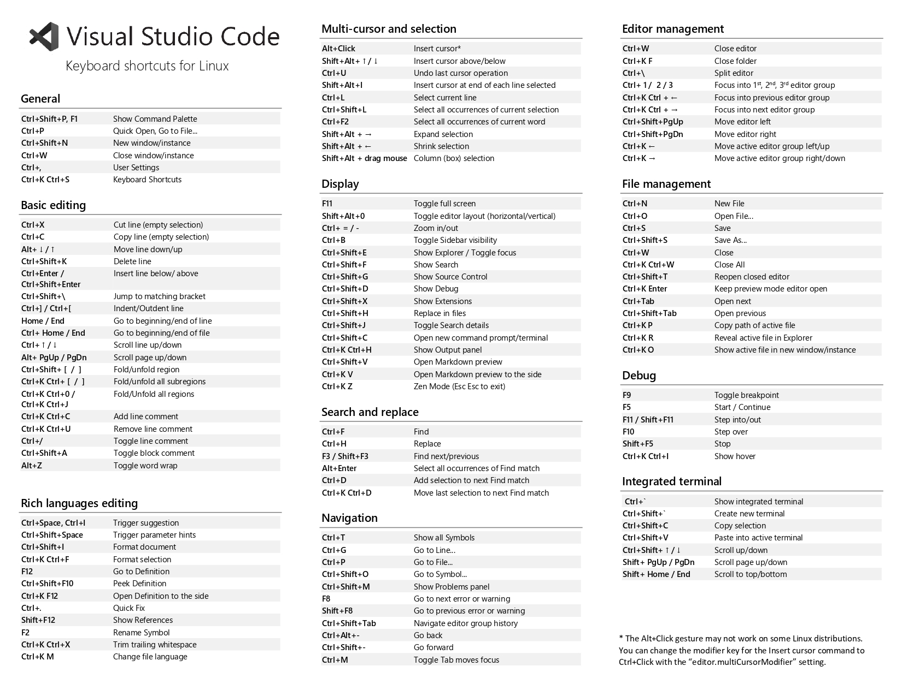

# Visual Studio Code

Ayuda oficial -> [Tips & Tricks](https://code.visualstudio.com/docs/getstarted/tips-and-tricks)

???+ tip "Fernando Herrera tiene un curso de VSCode"
    Repo de un curso a Introducción a VSCode -> [repo](https://github.com/Klerith/curso-VSCode)

## Atajos de teclado

Enlaces a las hojas de resumen de atajos de teclado.

=== "Linux"
    [Enlace oficial Linux](https://code.visualstudio.com/shortcuts/keyboard-shortcuts-linux.pdf)
    

=== "Mac"
    [Enlace oficial Mac](https://code.visualstudio.com/shortcuts/keyboard-shortcuts-macos.pdf)
    

=== "Windows"
    [Enlace oficial Windows](https://code.visualstudio.com/shortcuts/keyboard-shortcuts-windows.pdf)
    

## Atajos interesantes

| Comando | Atajo  de teclado |
| :------ | :---------------: |
| Multiples cursores | Mantengo ++alt++ y luego click donde quiera cursores |
| Multiples cursores con palabras | Mantengo ++alt++ y luego doble click las palabras donde quiera cursores |
| Duplicar cursor hacia arriba | ++ctrl+shift+up++ |
| Selecionar lineas | Mantener ++alt++ y click en la línea |
| Duplicar cursor hacia abajo | ++ctrl+shift+down++ |
| Mover líneas arriba | ++alt+up++ |
| Mover líneas abajo | ++alt+down++ |
| Comentar / descomentar línea | Linux ++ctrl+slash++ Mac ++cmd+slash++ |
| Ir a la definición de una función o variable | Cursor sobre la función o variable y ++f12++ |
| Borrar línea | Oficial ++ctrl+shift+k++ Para mi es ++ctrl+d++ |
| Borrar todas las ocurrencias de una palabra / variable/ funcion/... | Cursor sobre la palabra / variable / funcion /... + Seleccionar todas con Linux ++ctrl+shift+l++ Mac ++cmd+shift+l++ + Borrar línea | 
| Deshacer | Linux ++ctrl+z++ Mac ++cmd+z++ |
| Rehacer | Linux ++ctrl+shift+z++ Mac ++cmd+shift+z++ |
| Toggle sidebar | Linux ++ctrl+b++ Mac ++cmd+b++ |
| Pantalla completa | ++f11++ |
| Toggle Modo Zen | Linux ++ctrl+k++ y ++z++ Mac ++cmd+k++ y ++z++ |
| Toggle terminal | Linux ++ctrl+j++ Mac ++cmd+j++ |
| Cambiar pestaña | ++ctrl+tab++ |
| Cerrar pestaña | Linux ++ctrl+w++ Mac ++cmd+w++ |
| Reabrir pestaña | Linux ++ctrl+shift+t++ Mac ++cmd+shift+t++ |
| Cerrar todas las pestañas | Linux ++ctrl+k++ y ++ctrl+w++ Mac ++cmd+k++ y ++cmd+w++ |
| Copiar linea arriba | Linux ++ctrl+shift+up++ Mac ++cmd+shift+up++ | 
| Copiar linea abajo | Linux ++ctrl+shift+down++ Mac ++cmd+shift+down++ | 
| Abrir fichero (útil en el Modo Zen) | Linux ++ctrl+p++ Mac ++cmd+p++ |
| Abrir paleta de comandos | Linux ++ctrl+alt+p++ o ++ctrl+p++ y luego escribir ++>++ Mac ++cmd+alt+p++ o ++cmd+p++ y luego escribir ++>++ |
| Ir a una línea del fichero | Linux ++ctrl+g++ o ++ctrl+p++ y luego escribir ++:++ Mac ++cmd+g++ o ++cmd+p++ y luego escribir ++:++ |
| Ver definición de una clase / función / etc en un fichero | Linux ++ctrl+p++ y luego escribir ++@++ Mac ++cmd+p++ y luego escribir ++@++ |
| Ordenar por definición de una clase / función / etc en un fichero | Linux ++ctrl+p++ y luego escribir ++@:++ Mac ++cmd+p++ y luego escribir ++@:++ |
| Cambiar nombre a un fichero | Con el fichero seleccionado en la navbar y pulsar ++f2++ |
| Refactor de una variable / función / clase | Seleccionar una variable / función / clase y pulsar ++f2++ |
| Markdown preview | Linux ++ctrl+shift+v++ Mac ++cmd+shift+v++ |
| Markdown preview en el lateral | Linux ++ctrl+k++ y luego ++v++ Mac ++cmd+k++ y luego ++v++ |
| Markdown preview en el lateral fija | Tiene que ser desde la paleta de comandos |
